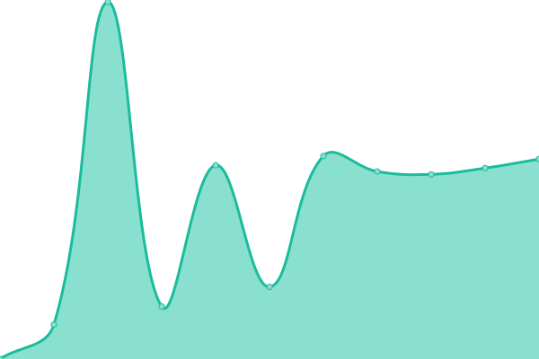

# [📈 Live Status](https://demo.upptime.js.org): <!--live status--> **🟩 All systems operational**

This repository contains the open-source uptime monitor and status page for [Upptime](https://upptime.js.org), powered by [Upptime](https://github.com/upptime/upptime).

With [Upptime](https://upptime.js.org), you can get your own unlimited and free uptime monitor and status page, powered entirely by a GitHub repository. We use [Issues](https://github.com/upptime/upptime/issues) as incident reports, [Actions](https://github.com/trinitisolutions/srs-uptime-monitor/actions) as uptime monitors, and [Pages](https://demo.upptime.js.org) for the status page.

<!--start: status pages-->
<!-- This summary is generated by Upptime (https://github.com/upptime/upptime) -->
<!-- Do not edit this manually, your changes will be overwritten -->
<!-- prettier-ignore -->
| URL | Status | History | Response Time | Uptime |
| --- | ------ | ------- | ------------- | ------ |
|  [Dashboard](https://robot-maatje.com/status) | 🟩 Up | [dashboard.yml](https://github.com/trinitisolutions/srs-uptime-monitor/commits/HEAD/history/dashboard.yml) | 

 2066ms
     
 | 

<a href="https://trinitisolutions.github.io/srs-uptime-monitor/history/dashboard">100.00%</a>
    

|  [Admin](https://admin.robot-maatje.com/status) | 🟩 Up | [admin.yml](https://github.com/trinitisolutions/srs-uptime-monitor/commits/HEAD/history/admin.yml) | 

 1507ms
     
 | 

<a href="https://trinitisolutions.github.io/srs-uptime-monitor/history/admin">99.79%</a>
    

|  [Robot service](https://srs.triniti.nl/api/robots) | 🟩 Up | [robot-service.yml](https://github.com/trinitisolutions/srs-uptime-monitor/commits/HEAD/history/robot-service.yml) | 

 406ms
     
 | 

<a href="https://trinitisolutions.github.io/srs-uptime-monitor/history/robot-service">100.00%</a>
    

|  [Management service](https://srs.triniti.nl/api/customers) | 🟩 Up | [management-service.yml](https://github.com/trinitisolutions/srs-uptime-monitor/commits/HEAD/history/management-service.yml) | 

 118ms
     
 | 

<a href="https://trinitisolutions.github.io/srs-uptime-monitor/history/management-service">100.00%</a>
    

|  [Dev Dashboard](https://dashboard.srs.appset.nl/status) | 🟩 Up | [dev-dashboard.yml](https://github.com/trinitisolutions/srs-uptime-monitor/commits/HEAD/history/dev-dashboard.yml) | 

 1836ms
     
 | 

<a href="https://trinitisolutions.github.io/srs-uptime-monitor/history/dev-dashboard">99.80%</a>
    

|  [Dev Admin](https://admin.srs.appset.nl/status) | 🟩 Up | [dev-admin.yml](https://github.com/trinitisolutions/srs-uptime-monitor/commits/HEAD/history/dev-admin.yml) | 

 1645ms
     
 | 

<a href="https://trinitisolutions.github.io/srs-uptime-monitor/history/dev-admin">99.80%</a>
    

|  [Dev Robot service](https://srs.appset.nl/api/robots) | 🟩 Up | [dev-robot-service.yml](https://github.com/trinitisolutions/srs-uptime-monitor/commits/HEAD/history/dev-robot-service.yml) | 

 406ms
     
 | 

<a href="https://trinitisolutions.github.io/srs-uptime-monitor/history/dev-robot-service">100.00%</a>
    

|  [Dev Management service](https://srs.appset.nl/api/customers) | 🟩 Up | [dev-management-service.yml](https://github.com/trinitisolutions/srs-uptime-monitor/commits/HEAD/history/dev-management-service.yml) | 

 164ms
     
 | 

<a href="https://trinitisolutions.github.io/srs-uptime-monitor/history/dev-management-service">100.00%</a>
    

<!--end: status pages-->

[**Visit our status website →**](https://trinitisolutions.github.io/srs-uptime-monitor/)

## 📄 License

- Powered by: [Upptime](https://github.com/upptime/upptime)
- Code: [MIT](./LICENSE) © [Upptime](https://upptime.js.org)
- Data in the `./history` directory: [Open Database License](https://opendatacommons.org/licenses/odbl/1-0/)
